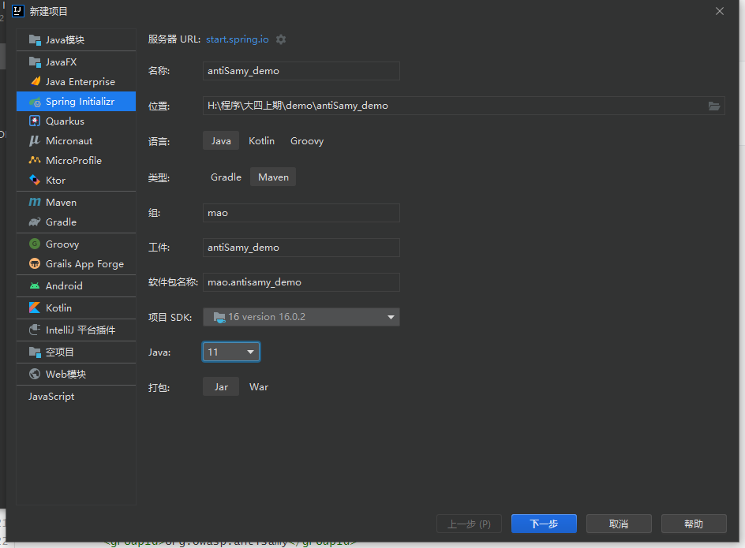
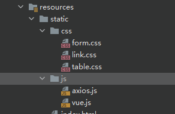
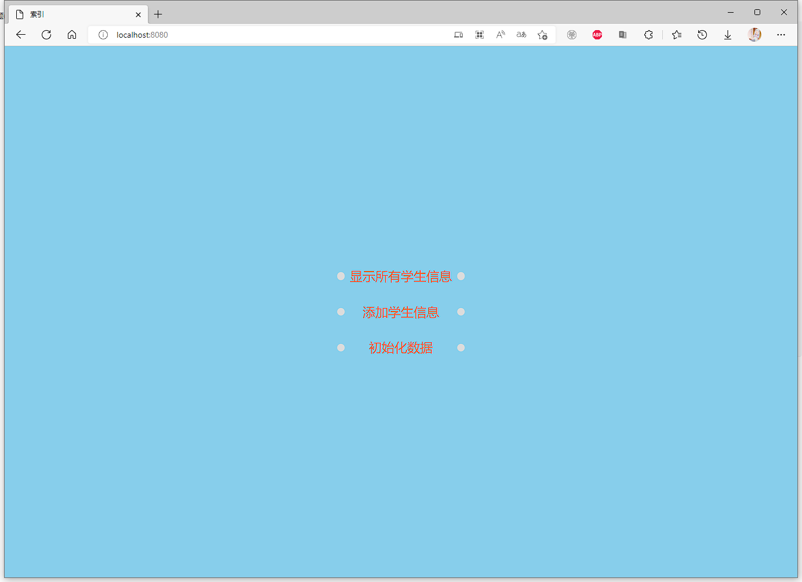
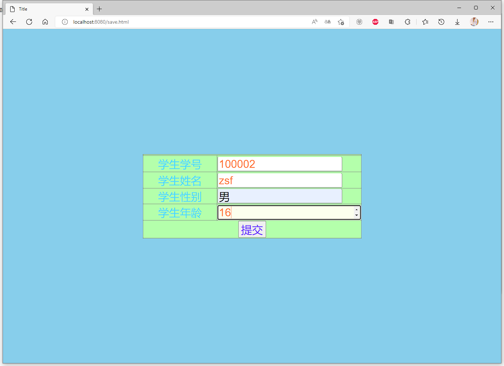
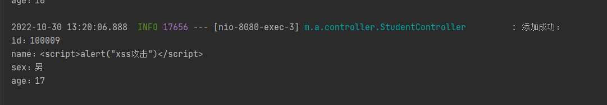
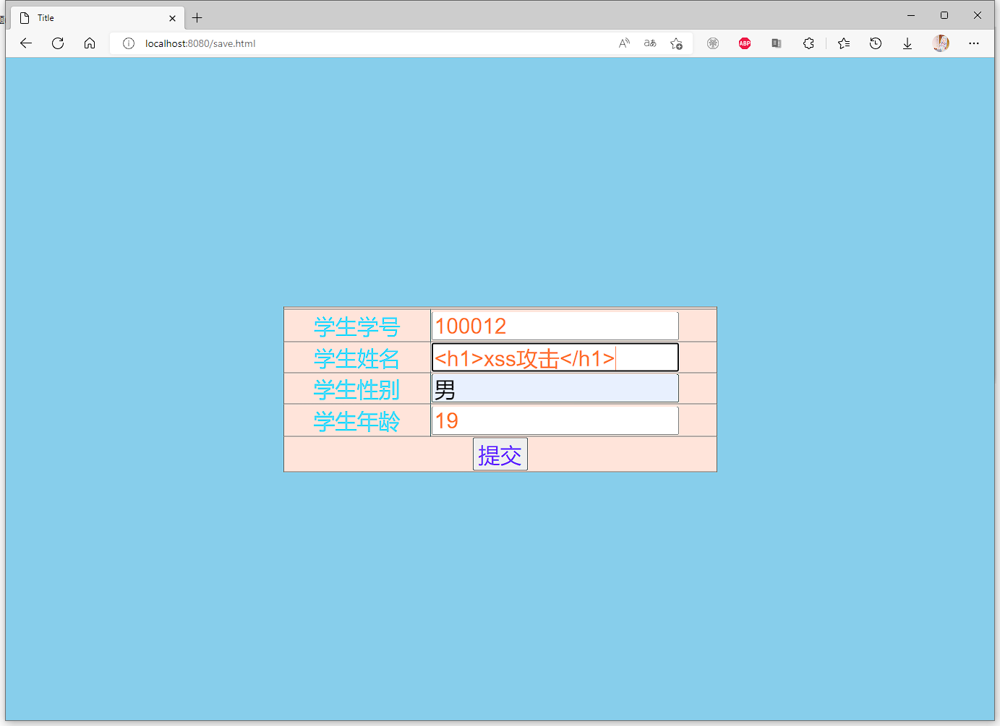
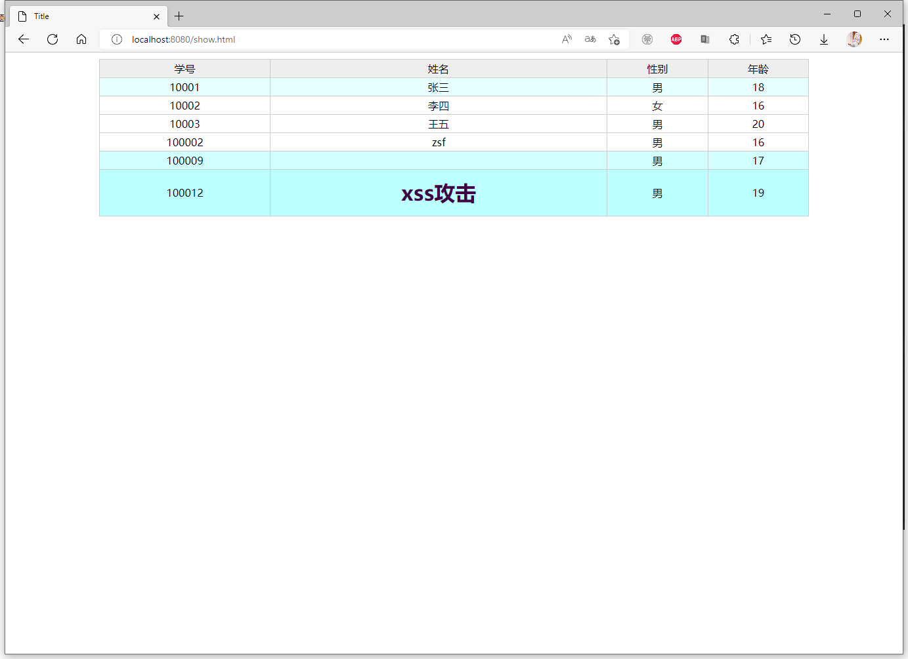

# AntiSamy

## XSS介绍

XSS：跨站脚本攻击(Cross Site Scripting)，为不和 CSS混淆，故将跨站脚本攻击缩写为XSS。XSS是指恶意攻击者往Web页面里插入恶意Script代码，当用户浏览该页时，嵌入其中Web里面的Script代码会被执行，从而达到恶意攻击用户的目的。有点类似于sql注入。

XSS攻击原理：

HTML是一种超文本标记语言，通过将一些字符特殊地对待来区别文本和标记，例如，小于符号（<）被看作是HTML标签的开始，<title>与</title>之间的字符是页面的标题等等。当动态页面中插入的内容含有这些特殊字符时，用户浏览器会将其误认为是插入了HTML标签，当这些HTML标签引入了一段JavaScript脚本时，这些脚本程序就将会在用户浏览器中执行。所以，当这些特殊字符不能被动态页面检查或检查出现失误时，就将会产生XSS漏洞。


## AntiSamy介绍

AntiSamy是OWASP的一个开源项目，通过对用户输入的 HTML / CSS / JavaScript 等内容进行检验和清理，确保输入符合应用规范。AntiSamy被广泛应用于Web服务对存储型和反射型XSS的防御中。


AntiSamy的maven坐标：

```xml
<dependency>
  <groupId>org.owasp.antisamy</groupId>
  <artifactId>antisamy</artifactId>
  <version>1.5.7</version>
</dependency>
```


## AntiSamy入门案例


### 演示xss攻击


#### 第一步：创建工程antiSamy_demo





#### 第二步：编写实体类Student


```java
package mao.antisamy_demo.entity;

/**
 * Project name(项目名称)：antiSamy_demo
 * Package(包名): mao.antisamy_demo.entity
 * Class(类名): Student
 * Author(作者）: mao
 * Author QQ：1296193245
 * GitHub：https://github.com/maomao124/
 * Date(创建日期)： 2022/10/29
 * Time(创建时间)： 20:01
 * Version(版本): 1.0
 * Description(描述)： 无
 */


public class Student
{
    /**
     * id
     */
    private long id;
    /**
     * 名字
     */
    private String name;
    /**
     * 性别
     */
    private String sex;
    /**
     * 年龄
     */
    private int age;

    /**
     * Instantiates a new Student.
     */
    public Student()
    {
        
    }

    /**
     * Instantiates a new Student.
     *
     * @param id   the id
     * @param name the name
     * @param sex  the sex
     * @param age  the age
     */
    public Student(long id, String name, String sex, int age)
    {
        this.id = id;
        this.name = name;
        this.sex = sex;
        this.age = age;
    }

    /**
     * Gets id.
     *
     * @return the id
     */
    public long getId()
    {
        return id;
    }

    /**
     * Sets id.
     *
     * @param id the id
     */
    public void setId(long id)
    {
        this.id = id;
    }

    /**
     * Gets name.
     *
     * @return the name
     */
    public String getName()
    {
        return name;
    }

    /**
     * Sets name.
     *
     * @param name the name
     */
    public void setName(String name)
    {
        this.name = name;
    }

    /**
     * Gets sex.
     *
     * @return the sex
     */
    public String getSex()
    {
        return sex;
    }

    /**
     * Sets sex.
     *
     * @param sex the sex
     */
    public void setSex(String sex)
    {
        this.sex = sex;
    }

    /**
     * Gets age.
     *
     * @return the age
     */
    public int getAge()
    {
        return age;
    }

    /**
     * Sets age.
     *
     * @param age the age
     */
    public void setAge(int age)
    {
        this.age = age;
    }

    @Override
    @SuppressWarnings("all")
    public String toString()
    {
        final StringBuilder stringbuilder = new StringBuilder();
        stringbuilder.append("id：").append(id).append('\n');
        stringbuilder.append("name：").append(name).append('\n');
        stringbuilder.append("sex：").append(sex).append('\n');
        stringbuilder.append("age：").append(age).append('\n');
        return stringbuilder.toString();
    }
}
```


#### 第三步：编写StudentController


```java
package mao.antisamy_demo.controller;

import mao.antisamy_demo.entity.Student;
import org.apache.juli.logging.Log;
import org.slf4j.Logger;
import org.slf4j.LoggerFactory;
import org.springframework.web.bind.annotation.*;

import java.util.ArrayList;
import java.util.Collections;
import java.util.List;

/**
 * Project name(项目名称)：antiSamy_demo
 * Package(包名): mao.antisamy_demo.controller
 * Class(类名): StudentController
 * Author(作者）: mao
 * Author QQ：1296193245
 * GitHub：https://github.com/maomao124/
 * Date(创建日期)： 2022/10/29
 * Time(创建时间)： 20:05
 * Version(版本): 1.0
 * Description(描述)： 无
 */

@RestController
@RequestMapping("/student")
public class StudentController
{
    private static final List<Student> list = Collections.synchronizedList(new ArrayList<>());

    private static final Logger log = LoggerFactory.getLogger(StudentController.class);

    @PostMapping("/init")
    public synchronized void init()
    {
        Student student1 = new Student(10001, "张三", "男", 18);
        Student student2 = new Student(10002, "李四", "女", 16);
        Student student3 = new Student(10003, "王五", "男", 20);
        list.clear();
        list.add(student1);
        list.add(student2);
        list.add(student3);
        log.info("初始化完成");
    }

    @PostMapping
    public boolean save(@RequestBody Student student)
    {
        list.add(student);
        log.info("添加成功：\n" + student);
        return true;
    }

    @GetMapping
    public List<Student> getAll()
    {
        log.info("查询所有：\n" + list);
        return list;
    }

}
```


#### 第四步：编写样式表form.css


```css
/*
  Project name(项目名称)：antiSamy_demo 
  File name(文件名): form
  Author(作者）: mao
  Author QQ：1296193245
  GitHub：https://github.com/maomao124/
  Date(创建日期)： 2022/10/29 
  Time(创建时间)： 20:54
  Version(版本): 1.0
  Description(描述)： 无
 */


/*表单位置*/
div.form_position {
    position: absolute;
    top: 50%;
    left: 50%;
    transform: translate(-50%, -50%);
}

/*表单的边框*/
div.form {
    border: 10px skyblue dotted;
}


/*表*/
table {
    width: 600px;
    border-collapse: collapse;
    color: #4edaff;
    background-color: #ffe4da;
    transition: all 1s linear 0s;
}

table:hover {
    background-color: #b4ffab;
    /*width: 800px;*/
    /*transition: all 1s linear 0s;*/
}


/*设置字体*/
td, input, input.input {
    font-size: 30px;
}

input {
    /*font-size: 24px;*/
    /*width: 90%;*/
    color: coral;
}

input.input {
    width: 85%;
    color: coral;
    transition: all 0.5s linear 0s;
}

input.input:hover {
    width: 98%;
    transition: all 0.5s linear 0s;
    background-color: #fcffee;
}


/*设置提示*/
.prompt {
    text-align: center;
    width: 200px;
    transition: all 1s linear 0.2s;
}

.prompt:hover {
    transition: all 1s linear 0.2s;
    color: #ff2e2f;
}

/*提交按钮*/
input.submit {
    color: #6739ff;
}

input.submit:hover {

}

/*最上面的字*/
div.text {
    border: 10px violet dotted;
    text-align: center;
    font-size: 32px;
    color: tomato;
    background: bisque;
}

/*最上面的字的位置*/
div.text_position {
    position: absolute;
    top: 2%;
    left: 50%;
    transform: translate(-50%, 0%);
}
```


#### 第五步：编写样式表link.css


```css
/*
  Project name(项目名称)：antiSamy_demo 
  File name(文件名): link
  Author(作者）: mao
  Author QQ：1296193245
  GitHub：https://github.com/maomao124/
  Date(创建日期)： 2022/10/29 
  Time(创建时间)： 20:17
  Version(版本): 1.0
  Description(描述)： 无
 */


a {
    color: tomato;
    text-decoration: none;
    display: flex;
    justify-content: center;
    align-items: center;

    padding: 0;
    list-style-type: none;
    font-size: 22px;
    width: 10em;
    height: 2em;
    text-align: center;
    line-height: 2em;
    font-family: sans-serif;
    text-transform: capitalize;
    position: relative;
    margin: 0.8em;
}

/* 添加了左右两个圆点 */
a::before, a::after {
    content: '';
    position: absolute;
    width: 0.6em;
    height: 0.6em;
    background-color: gainsboro;
    top: calc(50% - 0.3em);
    border-radius: 50%;
    transition: 0.5s cubic-bezier(0.5, -0.5, 0.25, 1.5);
}

a::before {
    left: 0;
    z-index: -1;
}

a::after {
    right: 0;
    z-index: -2;
}

/* 添加悬浮效果 */
a:hover {
    color: deeppink;
}

/* 给前后伪元素添加悬浮效果，注意先后顺序，先是hover后是伪元素 */
a:hover::before, a:hover::after {
    width: 100%;
    height: 100%;
    border-radius: 0;
    background-color: dodgerblue;
}

a:hover::before {
    top: 0;
    left: -0.2em;
}

a:hover::after {
    right: -0.2em;
    filter: brightness(0.8);
}
```


#### 第六步：编写样式表table.css


```css
/*
  Project name(项目名称)：antiSamy_demo 
  File name(文件名): table
  Author(作者）: mao
  Author QQ：1296193245
  GitHub：https://github.com/maomao124/
  Date(创建日期)： 2022/10/29 
  Time(创建时间)： 20:33
  Version(版本): 1.0
  Description(描述)： 无
 */


table {
    width: 80%;
    background: #ccc;
    margin: 10px auto;
    /*border-collapse CSS 属性设置<table>内的单元格是否具有共享或单独的边框。*/
    /*collapse – 相邻单元格具有共享边框（折叠边框表格渲染模型）。*/
    border-collapse: collapse;
}

th, td {
    height: 25px;
    line-height: 25px;
    text-align: center;
    border: 1px solid #ccc;
    transition: all 0.4s linear 0s;
}

th {
    background: #eee;
    font-weight: normal;
}

tr {
    background: #fff;
    transition: all 2s linear 0s;
}

tr:hover {
    background: aqua;
    transition: all 0.4s linear 0s;
}

td:hover {
    color: magenta;
    transition: all 0.4s linear 0s;
}

td a {
    color: #06f;
    text-decoration: none;
}

td a:hover {
    color: #06f;
    text-decoration: underline;
    /*transition: all 1s linear 0s;*/
}

caption {
    color: #28ffc7;
    font-size: 28px;
}
```


#### 第七步：添加vue和axios库





cdn：


```html
<script src="https://cdn.jsdelivr.net/npm/axios/dist/axios.min.js"></script>
```


```html
<script src="https://cdn.bootcss.com/vue/2.5.2/vue.min.js"></script>
```


#### 第八步：编写index.html


```html
<!DOCTYPE html>

<!--
Project name(项目名称)：antiSamy_demo
  File name(文件名): index
  Authors(作者）: mao
  Author QQ：1296193245
  GitHub：https://github.com/maomao124/
  Date(创建日期)： 2022/10/29
  Time(创建时间)： 20:03
  Description(描述)： 无
-->

<html lang="en">
<head>
    <meta charset="UTF-8">
    <title>索引</title>
    <link rel="stylesheet" href="/css/link.css">
    <script src="/js/axios.js"></script>


    <style>
        body {
            background-color: skyblue;
        }

        div.a {
            position: absolute;
            top: 50%;
            left: 50%;
            transform: translate(-50%, -50%);
        }
    </style>
</head>
<body>

<div class="a">

    <a href="/show.html">显示所有学生信息</a>
    <a href="/save.html">添加学生信息</a>
    <a href="" onclick="init()">初始化数据</a>

</div>

<script>

    function init()
    {
        //axios发起ajax请求
        axios({
            //请求的方式：
            method: "post",
            //请求的url:
            url: "/student/init",
            //url参数：
            params:
                {},
            //头信息：
            headers:
                {},
            //请求体参数：
            data:
                {},
        }).then(response =>
        {
            console.log(response);
            alert("初始化数据成功");
        }).catch(error =>
        {
            //console.log(error);
            alert("网络异常！");
        })
    }

</script>

</body>
</html>
```


#### 第九步：编写show.html


```html
<!DOCTYPE html>

<!--
Project name(项目名称)：antiSamy_demo
  File name(文件名): show
  Authors(作者）: mao
  Author QQ：1296193245
  GitHub：https://github.com/maomao124/
  Date(创建日期)： 2022/10/29
  Time(创建时间)： 20:23
  Description(描述)： 无
-->

<html lang="en">
<head>
    <meta charset="UTF-8">
    <title>Title</title>
    <link rel="stylesheet" href="/css/table.css">
    <script src="/js/axios.js"></script>
    <script src="/js/vue.js"></script>
</head>
<body>

<div id="app">

    <table>
        <tr>
            <th>学号</th>
            <th>姓名</th>
            <th>性别</th>
            <th>年龄</th>
        </tr>
        <tr v-for="student in studentList">
            <td v-html="student.id"></td>
            <td v-html="student.name"></td>
            <td v-html="student.sex"></td>
            <td v-html="student.age"></td>
        </tr>
    </table>

</div>

</body>

<script>

    var app = new Vue({
        el: "#app",
        data: {
            studentList: null
        },
        method: {},
        mounted: function ()
        {
            //axios发起ajax请求
            axios({
                //请求的方式：
                method: "get",
                //请求的url:
                url: "/student",
                //url参数：
                params:
                    {},
                //头信息：
                headers:
                    {},
                //请求体参数：
                data:
                    {},
            }).then(response =>
            {
                console.log(response);
                this.studentList = response.data;

            }).catch(error =>
            {
                //console.log(error);
                alert("网络异常！");
            })
        }
    })

</script>
</html>
```


#### 第十步：编写save.html


```html
<!DOCTYPE html>

<!--
Project name(项目名称)：antiSamy_demo
  File name(文件名): save
  Authors(作者）: mao
  Author QQ：1296193245
  GitHub：https://github.com/maomao124/
  Date(创建日期)： 2022/10/29
  Time(创建时间)： 20:23
  Description(描述)： 无
-->

<html lang="en">
<head>
    <meta charset="UTF-8">
    <title>Title</title>
    <link rel="stylesheet" href="css/form.css">
    <script src="js/axios.js"></script>
    <script src="js/vue.js"></script>
    <style>
        body {
            background-color: skyblue;
        }
    </style>
</head>
<body>

<div id="app">


    <div class="form_position">
        <div class="animated bounceInDown">
            <div class="form">
                <form action="" method="post">
                    <table border="1">
                        <tr>
                            <td colspan="2" align="center">
                            </td>
                        </tr>
                        <tr>
                            <td class="prompt">学生学号</td>
                            <td>
                                <label>
                                    <input v-model="student.id" class="input" type="number" name="id">
                                </label>
                            </td>
                        </tr>
                        <tr>
                            <td class="prompt">学生姓名</td>
                            <td>
                                <label>
                                    <input v-model="student.name" class="input" type="text" name="name">
                                </label>
                            </td>
                        </tr>
                        <tr>
                            <td class="prompt">学生性别</td>
                            <td>
                                <label>
                                    <input v-model="student.sex" class="input" type="text" name="sex">
                                </label>
                            </td>
                        </tr>
                        <tr>
                            <td class="prompt">学生年龄</td>
                            <td>
                                <label>
                                    <input v-model="student.age" class="input" type="number" name="age">
                                </label>
                            </td>
                        </tr>
                        <tr>
                            <td colspan="2" align="center">
                                <input @click="f()" class="submit" type="button" value="提交"/>
                            </td>
                        </tr>
                    </table>
                </form>
            </div>
        </div>
    </div>

</div>

<!--<script>alert("xss攻击")</script>-->
<!--<h1>xss攻击</h1>-->

<script>

    var app = new Vue(
        {
            el: "#app",
            data: {
                student: {
                    id: null,
                    name: null,
                    sex: null,
                    age: null,
                }
            },
            methods: {
                f: function ()
                {
                    console.log("提交")
                    console.log(this.student)
                    var that = this;
                    //axios发起ajax请求
                    axios({
                        //请求的方式：
                        method: "post",
                        //请求的url:
                        url: "/student",
                        //url参数：
                        params:
                            {},
                        //头信息：
                        headers:
                            {},
                        //请求体参数：
                        data:
                            {
                                id: that.student.id,
                                name: that.student.name,
                                sex: that.student.sex,
                                age: that.student.age,
                            },
                    }).then(response =>
                    {
                        console.log(response);
                        if (response.data === true)
                        {
                            alert("请求成功")
                        }
                        else
                        {
                            alert("失败")
                        }

                    }).catch(error =>
                    {
                        //console.log(error);
                        alert("网络异常！");
                    })
                }
            }
        }
    )

</script>

</body>
</html>
```


#### 第十一步：启动程序


```sh

  .   ____          _            __ _ _
 /\\ / ___'_ __ _ _(_)_ __  __ _ \ \ \ \
( ( )\___ | '_ | '_| | '_ \/ _` | \ \ \ \
 \\/  ___)| |_)| | | | | || (_| |  ) ) ) )
  '  |____| .__|_| |_|_| |_\__, | / / / /
 =========|_|==============|___/=/_/_/_/
 :: Spring Boot ::                (v2.7.1)

2022-10-30 13:14:22.269  INFO 17656 --- [           main] m.antisamy_demo.AntiSamyDemoApplication  : Starting AntiSamyDemoApplication using Java 16.0.2 on mao with PID 17656 (H:\程序\大四上期\demo\antiSamy_demo\target\classes started by mao in H:\程序\大四上期\demo\antiSamy_demo)
2022-10-30 13:14:22.271  INFO 17656 --- [           main] m.antisamy_demo.AntiSamyDemoApplication  : No active profile set, falling back to 1 default profile: "default"
2022-10-30 13:14:22.970  INFO 17656 --- [           main] o.s.b.w.embedded.tomcat.TomcatWebServer  : Tomcat initialized with port(s): 8080 (http)
2022-10-30 13:14:22.980  INFO 17656 --- [           main] o.apache.catalina.core.StandardService   : Starting service [Tomcat]
2022-10-30 13:14:22.980  INFO 17656 --- [           main] org.apache.catalina.core.StandardEngine  : Starting Servlet engine: [Apache Tomcat/9.0.64]
2022-10-30 13:14:23.057  INFO 17656 --- [           main] o.a.c.c.C.[Tomcat].[localhost].[/]       : Initializing Spring embedded WebApplicationContext
2022-10-30 13:14:23.057  INFO 17656 --- [           main] w.s.c.ServletWebServerApplicationContext : Root WebApplicationContext: initialization completed in 746 ms
2022-10-30 13:14:23.198  INFO 17656 --- [           main] o.s.b.a.w.s.WelcomePageHandlerMapping    : Adding welcome page: class path resource [static/index.html]
2022-10-30 13:14:23.318  INFO 17656 --- [           main] o.s.b.w.embedded.tomcat.TomcatWebServer  : Tomcat started on port(s): 8080 (http) with context path ''
2022-10-30 13:14:23.328  INFO 17656 --- [           main] m.antisamy_demo.AntiSamyDemoApplication  : Started AntiSamyDemoApplication in 1.355 seconds (JVM running for 2.735)
```


#### 第十二步：访问


http://localhost:8080/





#### 第十三步：初始化数据


#### 第十四步：查看所有学生的信息


#### 第十五步：添加学生信息











#### 十六步：查询所有学生的信息





因为是浏览器的原因，浏览器直接把脚本拦截了，但是h1标签还在


数据接收是正常的


### 解决xss攻击


