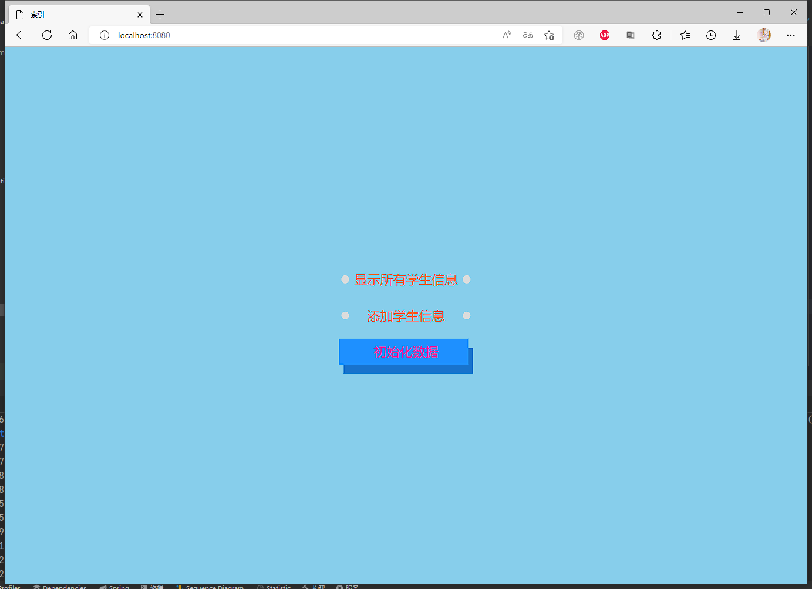
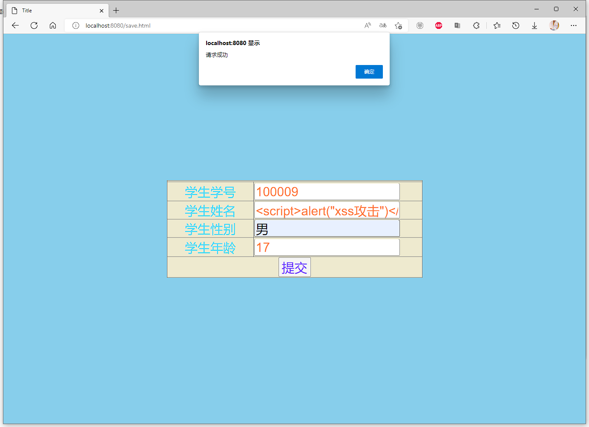
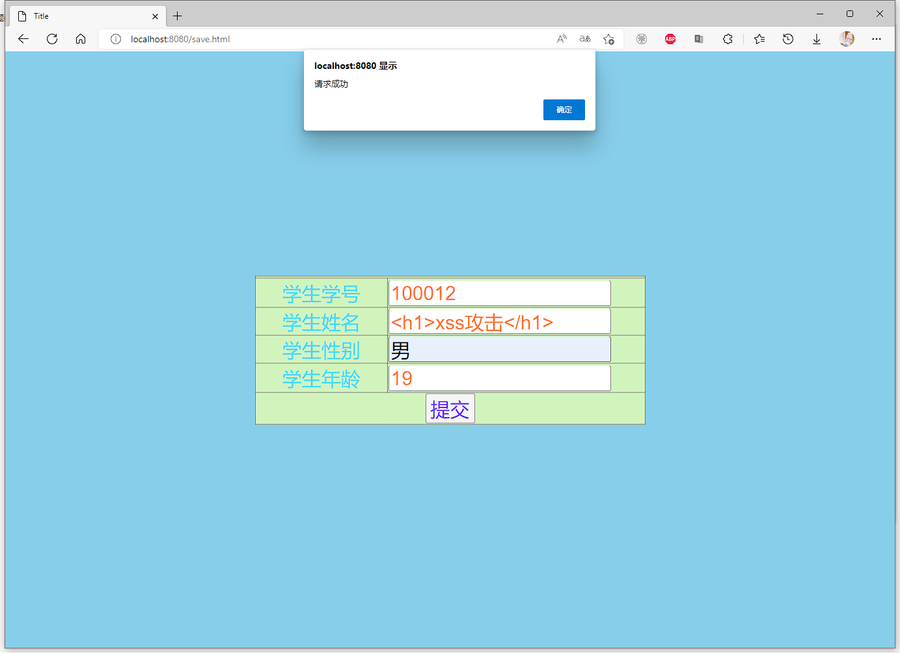
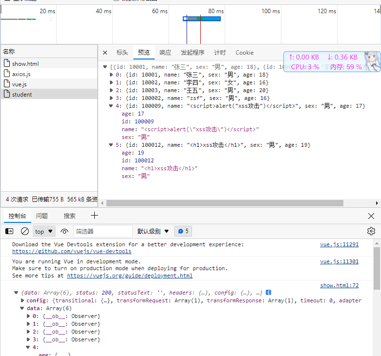
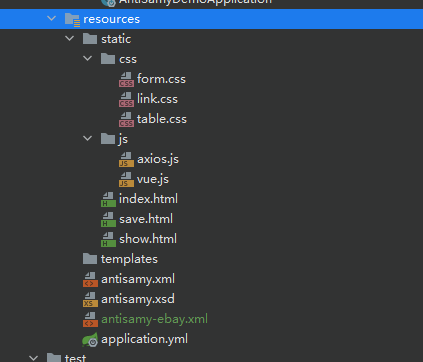
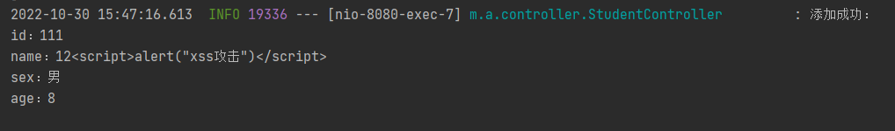
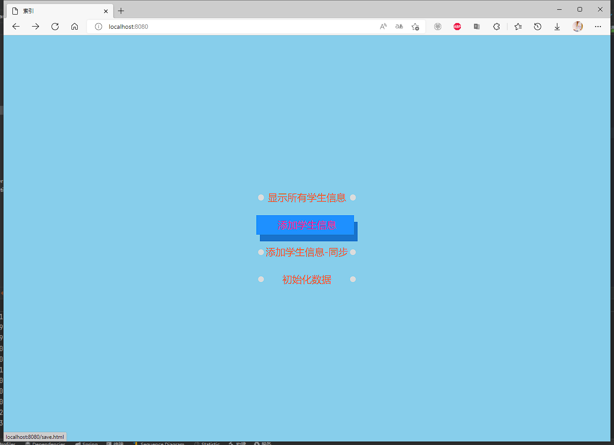

# AntiSamy

## XSS介绍

XSS：跨站脚本攻击(Cross Site Scripting)，为不和 CSS混淆，故将跨站脚本攻击缩写为XSS。XSS是指恶意攻击者往Web页面里插入恶意Script代码，当用户浏览该页时，嵌入其中Web里面的Script代码会被执行，从而达到恶意攻击用户的目的。有点类似于sql注入。

XSS攻击原理：

HTML是一种超文本标记语言，通过将一些字符特殊地对待来区别文本和标记，例如，小于符号（<）被看作是HTML标签的开始，<title>与</title>之间的字符是页面的标题等等。当动态页面中插入的内容含有这些特殊字符时，用户浏览器会将其误认为是插入了HTML标签，当这些HTML标签引入了一段JavaScript脚本时，这些脚本程序就将会在用户浏览器中执行。所以，当这些特殊字符不能被动态页面检查或检查出现失误时，就将会产生XSS漏洞。


## AntiSamy介绍

AntiSamy是OWASP的一个开源项目，通过对用户输入的 HTML / CSS / JavaScript 等内容进行检验和清理，确保输入符合应用规范。AntiSamy被广泛应用于Web服务对存储型和反射型XSS的防御中。


AntiSamy的maven坐标：

```xml
<dependency>
  <groupId>org.owasp.antisamy</groupId>
  <artifactId>antisamy</artifactId>
  <version>1.5.7</version>
</dependency>
```


## AntiSamy入门案例


### 演示xss攻击


#### 第一步：创建工程antiSamy_demo


#### 第二步：编写实体类Student


```java
package mao.antisamy_demo.entity;

/**
 * Project name(项目名称)：antiSamy_demo
 * Package(包名): mao.antisamy_demo.entity
 * Class(类名): Student
 * Author(作者）: mao
 * Author QQ：1296193245
 * GitHub：https://github.com/maomao124/
 * Date(创建日期)： 2022/10/29
 * Time(创建时间)： 20:01
 * Version(版本): 1.0
 * Description(描述)： 无
 */


public class Student
{
    /**
     * id
     */
    private long id;
    /**
     * 名字
     */
    private String name;
    /**
     * 性别
     */
    private String sex;
    /**
     * 年龄
     */
    private int age;

    /**
     * Instantiates a new Student.
     */
    public Student()
    {
        
    }

    /**
     * Instantiates a new Student.
     *
     * @param id   the id
     * @param name the name
     * @param sex  the sex
     * @param age  the age
     */
    public Student(long id, String name, String sex, int age)
    {
        this.id = id;
        this.name = name;
        this.sex = sex;
        this.age = age;
    }

    /**
     * Gets id.
     *
     * @return the id
     */
    public long getId()
    {
        return id;
    }

    /**
     * Sets id.
     *
     * @param id the id
     */
    public void setId(long id)
    {
        this.id = id;
    }

    /**
     * Gets name.
     *
     * @return the name
     */
    public String getName()
    {
        return name;
    }

    /**
     * Sets name.
     *
     * @param name the name
     */
    public void setName(String name)
    {
        this.name = name;
    }

    /**
     * Gets sex.
     *
     * @return the sex
     */
    public String getSex()
    {
        return sex;
    }

    /**
     * Sets sex.
     *
     * @param sex the sex
     */
    public void setSex(String sex)
    {
        this.sex = sex;
    }

    /**
     * Gets age.
     *
     * @return the age
     */
    public int getAge()
    {
        return age;
    }

    /**
     * Sets age.
     *
     * @param age the age
     */
    public void setAge(int age)
    {
        this.age = age;
    }

    @Override
    @SuppressWarnings("all")
    public String toString()
    {
        final StringBuilder stringbuilder = new StringBuilder();
        stringbuilder.append("id：").append(id).append('\n');
        stringbuilder.append("name：").append(name).append('\n');
        stringbuilder.append("sex：").append(sex).append('\n');
        stringbuilder.append("age：").append(age).append('\n');
        return stringbuilder.toString();
    }
}
```


#### 第三步：编写StudentController


```java
package mao.antisamy_demo.controller;

import mao.antisamy_demo.entity.Student;
import org.apache.juli.logging.Log;
import org.slf4j.Logger;
import org.slf4j.LoggerFactory;
import org.springframework.web.bind.annotation.*;

import java.util.ArrayList;
import java.util.Collections;
import java.util.List;

/**
 * Project name(项目名称)：antiSamy_demo
 * Package(包名): mao.antisamy_demo.controller
 * Class(类名): StudentController
 * Author(作者）: mao
 * Author QQ：1296193245
 * GitHub：https://github.com/maomao124/
 * Date(创建日期)： 2022/10/29
 * Time(创建时间)： 20:05
 * Version(版本): 1.0
 * Description(描述)： 无
 */

@RestController
@RequestMapping("/student")
public class StudentController
{
    private static final List<Student> list = Collections.synchronizedList(new ArrayList<>());

    private static final Logger log = LoggerFactory.getLogger(StudentController.class);

    @PostMapping("/init")
    public synchronized void init()
    {
        Student student1 = new Student(10001, "张三", "男", 18);
        Student student2 = new Student(10002, "李四", "女", 16);
        Student student3 = new Student(10003, "王五", "男", 20);
        list.clear();
        list.add(student1);
        list.add(student2);
        list.add(student3);
        log.info("初始化完成");
    }

    @PostMapping
    public boolean save(@RequestBody Student student)
    {
        list.add(student);
        log.info("添加成功：\n" + student);
        return true;
    }

    @GetMapping
    public List<Student> getAll()
    {
        log.info("查询所有：\n" + list);
        return list;
    }

}
```


#### 第四步：编写样式表form.css


```css
/*
  Project name(项目名称)：antiSamy_demo 
  File name(文件名): form
  Author(作者）: mao
  Author QQ：1296193245
  GitHub：https://github.com/maomao124/
  Date(创建日期)： 2022/10/29 
  Time(创建时间)： 20:54
  Version(版本): 1.0
  Description(描述)： 无
 */


/*表单位置*/
div.form_position {
    position: absolute;
    top: 50%;
    left: 50%;
    transform: translate(-50%, -50%);
}

/*表单的边框*/
div.form {
    border: 10px skyblue dotted;
}


/*表*/
table {
    width: 600px;
    border-collapse: collapse;
    color: #4edaff;
    background-color: #ffe4da;
    transition: all 1s linear 0s;
}

table:hover {
    background-color: #b4ffab;
    /*width: 800px;*/
    /*transition: all 1s linear 0s;*/
}


/*设置字体*/
td, input, input.input {
    font-size: 30px;
}

input {
    /*font-size: 24px;*/
    /*width: 90%;*/
    color: coral;
}

input.input {
    width: 85%;
    color: coral;
    transition: all 0.5s linear 0s;
}

input.input:hover {
    width: 98%;
    transition: all 0.5s linear 0s;
    background-color: #fcffee;
}


/*设置提示*/
.prompt {
    text-align: center;
    width: 200px;
    transition: all 1s linear 0.2s;
}

.prompt:hover {
    transition: all 1s linear 0.2s;
    color: #ff2e2f;
}

/*提交按钮*/
input.submit {
    color: #6739ff;
}

input.submit:hover {

}

/*最上面的字*/
div.text {
    border: 10px violet dotted;
    text-align: center;
    font-size: 32px;
    color: tomato;
    background: bisque;
}

/*最上面的字的位置*/
div.text_position {
    position: absolute;
    top: 2%;
    left: 50%;
    transform: translate(-50%, 0%);
}
```


#### 第五步：编写样式表link.css


```css
/*
  Project name(项目名称)：antiSamy_demo 
  File name(文件名): link
  Author(作者）: mao
  Author QQ：1296193245
  GitHub：https://github.com/maomao124/
  Date(创建日期)： 2022/10/29 
  Time(创建时间)： 20:17
  Version(版本): 1.0
  Description(描述)： 无
 */


a {
    color: tomato;
    text-decoration: none;
    display: flex;
    justify-content: center;
    align-items: center;

    padding: 0;
    list-style-type: none;
    font-size: 22px;
    width: 10em;
    height: 2em;
    text-align: center;
    line-height: 2em;
    font-family: sans-serif;
    text-transform: capitalize;
    position: relative;
    margin: 0.8em;
}

/* 添加了左右两个圆点 */
a::before, a::after {
    content: '';
    position: absolute;
    width: 0.6em;
    height: 0.6em;
    background-color: gainsboro;
    top: calc(50% - 0.3em);
    border-radius: 50%;
    transition: 0.5s cubic-bezier(0.5, -0.5, 0.25, 1.5);
}

a::before {
    left: 0;
    z-index: -1;
}

a::after {
    right: 0;
    z-index: -2;
}

/* 添加悬浮效果 */
a:hover {
    color: deeppink;
}

/* 给前后伪元素添加悬浮效果，注意先后顺序，先是hover后是伪元素 */
a:hover::before, a:hover::after {
    width: 100%;
    height: 100%;
    border-radius: 0;
    background-color: dodgerblue;
}

a:hover::before {
    top: 0;
    left: -0.2em;
}

a:hover::after {
    right: -0.2em;
    filter: brightness(0.8);
}
```


#### 第六步：编写样式表table.css


```css
/*
  Project name(项目名称)：antiSamy_demo 
  File name(文件名): table
  Author(作者）: mao
  Author QQ：1296193245
  GitHub：https://github.com/maomao124/
  Date(创建日期)： 2022/10/29 
  Time(创建时间)： 20:33
  Version(版本): 1.0
  Description(描述)： 无
 */


table {
    width: 80%;
    background: #ccc;
    margin: 10px auto;
    /*border-collapse CSS 属性设置<table>内的单元格是否具有共享或单独的边框。*/
    /*collapse – 相邻单元格具有共享边框（折叠边框表格渲染模型）。*/
    border-collapse: collapse;
}

th, td {
    height: 25px;
    line-height: 25px;
    text-align: center;
    border: 1px solid #ccc;
    transition: all 0.4s linear 0s;
}

th {
    background: #eee;
    font-weight: normal;
}

tr {
    background: #fff;
    transition: all 2s linear 0s;
}

tr:hover {
    background: aqua;
    transition: all 0.4s linear 0s;
}

td:hover {
    color: magenta;
    transition: all 0.4s linear 0s;
}

td a {
    color: #06f;
    text-decoration: none;
}

td a:hover {
    color: #06f;
    text-decoration: underline;
    /*transition: all 1s linear 0s;*/
}

caption {
    color: #28ffc7;
    font-size: 28px;
}
```


#### 第七步：添加vue和axios库


cdn：


```html
<script src="https://cdn.jsdelivr.net/npm/axios/dist/axios.min.js"></script>
```


```html
<script src="https://cdn.bootcss.com/vue/2.5.2/vue.min.js"></script>
```


#### 第八步：编写index.html


```html
<!DOCTYPE html>

<!--
Project name(项目名称)：antiSamy_demo
  File name(文件名): index
  Authors(作者）: mao
  Author QQ：1296193245
  GitHub：https://github.com/maomao124/
  Date(创建日期)： 2022/10/29
  Time(创建时间)： 20:03
  Description(描述)： 无
-->

<html lang="en">
<head>
    <meta charset="UTF-8">
    <title>索引</title>
    <link rel="stylesheet" href="/css/link.css">
    <script src="/js/axios.js"></script>


    <style>
        body {
            background-color: skyblue;
        }

        div.a {
            position: absolute;
            top: 50%;
            left: 50%;
            transform: translate(-50%, -50%);
        }
    </style>
</head>
<body>

<div class="a">

    <a href="/show.html">显示所有学生信息</a>
    <a href="/save.html">添加学生信息</a>
    <a href="" onclick="init()">初始化数据</a>

</div>

<script>

    function init()
    {
        //axios发起ajax请求
        axios({
            //请求的方式：
            method: "post",
            //请求的url:
            url: "/student/init",
            //url参数：
            params:
                {},
            //头信息：
            headers:
                {},
            //请求体参数：
            data:
                {},
        }).then(response =>
        {
            console.log(response);
            alert("初始化数据成功");
        }).catch(error =>
        {
            //console.log(error);
            alert("网络异常！");
        })
    }

</script>

</body>
</html>
```


#### 第九步：编写show.html


```html
<!DOCTYPE html>

<!--
Project name(项目名称)：antiSamy_demo
  File name(文件名): show
  Authors(作者）: mao
  Author QQ：1296193245
  GitHub：https://github.com/maomao124/
  Date(创建日期)： 2022/10/29
  Time(创建时间)： 20:23
  Description(描述)： 无
-->

<html lang="en">
<head>
    <meta charset="UTF-8">
    <title>Title</title>
    <link rel="stylesheet" href="/css/table.css">
    <script src="/js/axios.js"></script>
    <script src="/js/vue.js"></script>
</head>
<body>

<div id="app">

    <table>
        <tr>
            <th>学号</th>
            <th>姓名</th>
            <th>性别</th>
            <th>年龄</th>
        </tr>
        <tr v-for="student in studentList">
            <td v-html="student.id"></td>
            <td v-html="student.name"></td>
            <td v-html="student.sex"></td>
            <td v-html="student.age"></td>
        </tr>
    </table>

</div>

</body>

<script>

    var app = new Vue({
        el: "#app",
        data: {
            studentList: null
        },
        method: {},
        mounted: function ()
        {
            //axios发起ajax请求
            axios({
                //请求的方式：
                method: "get",
                //请求的url:
                url: "/student",
                //url参数：
                params:
                    {},
                //头信息：
                headers:
                    {},
                //请求体参数：
                data:
                    {},
            }).then(response =>
            {
                console.log(response);
                this.studentList = response.data;

            }).catch(error =>
            {
                //console.log(error);
                alert("网络异常！");
            })
        }
    })

</script>
</html>
```


#### 第十步：编写save.html


```html
<!DOCTYPE html>

<!--
Project name(项目名称)：antiSamy_demo
  File name(文件名): save
  Authors(作者）: mao
  Author QQ：1296193245
  GitHub：https://github.com/maomao124/
  Date(创建日期)： 2022/10/29
  Time(创建时间)： 20:23
  Description(描述)： 无
-->

<html lang="en">
<head>
    <meta charset="UTF-8">
    <title>Title</title>
    <link rel="stylesheet" href="css/form.css">
    <script src="js/axios.js"></script>
    <script src="js/vue.js"></script>
    <style>
        body {
            background-color: skyblue;
        }
    </style>
</head>
<body>

<div id="app">


    <div class="form_position">
        <div class="animated bounceInDown">
            <div class="form">
                <form action="" method="post">
                    <table border="1">
                        <tr>
                            <td colspan="2" align="center">
                            </td>
                        </tr>
                        <tr>
                            <td class="prompt">学生学号</td>
                            <td>
                                <label>
                                    <input v-model="student.id" class="input" type="number" name="id">
                                </label>
                            </td>
                        </tr>
                        <tr>
                            <td class="prompt">学生姓名</td>
                            <td>
                                <label>
                                    <input v-model="student.name" class="input" type="text" name="name">
                                </label>
                            </td>
                        </tr>
                        <tr>
                            <td class="prompt">学生性别</td>
                            <td>
                                <label>
                                    <input v-model="student.sex" class="input" type="text" name="sex">
                                </label>
                            </td>
                        </tr>
                        <tr>
                            <td class="prompt">学生年龄</td>
                            <td>
                                <label>
                                    <input v-model="student.age" class="input" type="number" name="age">
                                </label>
                            </td>
                        </tr>
                        <tr>
                            <td colspan="2" align="center">
                                <input @click="f()" class="submit" type="button" value="提交"/>
                            </td>
                        </tr>
                    </table>
                </form>
            </div>
        </div>
    </div>

</div>

<!--<script>alert("xss攻击")</script>-->
<!--<h1>xss攻击</h1>-->

<script>

    var app = new Vue(
        {
            el: "#app",
            data: {
                student: {
                    id: null,
                    name: null,
                    sex: null,
                    age: null,
                }
            },
            methods: {
                f: function ()
                {
                    console.log("提交")
                    console.log(this.student)
                    var that = this;
                    //axios发起ajax请求
                    axios({
                        //请求的方式：
                        method: "post",
                        //请求的url:
                        url: "/student",
                        //url参数：
                        params:
                            {},
                        //头信息：
                        headers:
                            {},
                        //请求体参数：
                        data:
                            {
                                id: that.student.id,
                                name: that.student.name,
                                sex: that.student.sex,
                                age: that.student.age,
                            },
                    }).then(response =>
                    {
                        console.log(response);
                        if (response.data === true)
                        {
                            alert("请求成功")
                        }
                        else
                        {
                            alert("失败")
                        }

                    }).catch(error =>
                    {
                        //console.log(error);
                        alert("网络异常！");
                    })
                }
            }
        }
    )

</script>

</body>
</html>
```


#### 第十一步：启动程序


```sh

  .   ____          _            __ _ _
 /\\ / ___'_ __ _ _(_)_ __  __ _ \ \ \ \
( ( )\___ | '_ | '_| | '_ \/ _` | \ \ \ \
 \\/  ___)| |_)| | | | | || (_| |  ) ) ) )
  '  |____| .__|_| |_|_| |_\__, | / / / /
 =========|_|==============|___/=/_/_/_/
 :: Spring Boot ::                (v2.7.1)

2022-10-30 13:14:22.269  INFO 17656 --- [           main] m.antisamy_demo.AntiSamyDemoApplication  : Starting AntiSamyDemoApplication using Java 16.0.2 on mao with PID 17656 (H:\程序\大四上期\demo\antiSamy_demo\target\classes started by mao in H:\程序\大四上期\demo\antiSamy_demo)
2022-10-30 13:14:22.271  INFO 17656 --- [           main] m.antisamy_demo.AntiSamyDemoApplication  : No active profile set, falling back to 1 default profile: "default"
2022-10-30 13:14:22.970  INFO 17656 --- [           main] o.s.b.w.embedded.tomcat.TomcatWebServer  : Tomcat initialized with port(s): 8080 (http)
2022-10-30 13:14:22.980  INFO 17656 --- [           main] o.apache.catalina.core.StandardService   : Starting service [Tomcat]
2022-10-30 13:14:22.980  INFO 17656 --- [           main] org.apache.catalina.core.StandardEngine  : Starting Servlet engine: [Apache Tomcat/9.0.64]
2022-10-30 13:14:23.057  INFO 17656 --- [           main] o.a.c.c.C.[Tomcat].[localhost].[/]       : Initializing Spring embedded WebApplicationContext
2022-10-30 13:14:23.057  INFO 17656 --- [           main] w.s.c.ServletWebServerApplicationContext : Root WebApplicationContext: initialization completed in 746 ms
2022-10-30 13:14:23.198  INFO 17656 --- [           main] o.s.b.a.w.s.WelcomePageHandlerMapping    : Adding welcome page: class path resource [static/index.html]
2022-10-30 13:14:23.318  INFO 17656 --- [           main] o.s.b.w.embedded.tomcat.TomcatWebServer  : Tomcat started on port(s): 8080 (http) with context path ''
2022-10-30 13:14:23.328  INFO 17656 --- [           main] m.antisamy_demo.AntiSamyDemoApplication  : Started AntiSamyDemoApplication in 1.355 seconds (JVM running for 2.735)
```


#### 第十二步：访问


http://localhost:8080/


#### 第十三步：初始化数据





#### 第十四步：查看所有学生的信息


#### 第十五步：添加学生信息








#### 十六步：查询所有学生的信息


因为是浏览器的原因，浏览器直接把脚本拦截了，但是h1标签还在


数据接收是正常的





### 解决xss攻击


第一步：添加依赖


```xml
<?xml version="1.0" encoding="UTF-8"?>
<project xmlns="http://maven.apache.org/POM/4.0.0" xmlns:xsi="http://www.w3.org/2001/XMLSchema-instance"
         xsi:schemaLocation="http://maven.apache.org/POM/4.0.0 https://maven.apache.org/xsd/maven-4.0.0.xsd">
    <modelVersion>4.0.0</modelVersion>
    <parent>
        <groupId>org.springframework.boot</groupId>
        <artifactId>spring-boot-starter-parent</artifactId>
        <version>2.7.1</version>
        <relativePath/> <!-- lookup parent from repository -->
    </parent>
    <groupId>mao</groupId>
    <artifactId>antiSamy_demo</artifactId>
    <version>0.0.1-SNAPSHOT</version>
    <name>antiSamy_demo</name>
    <description>antiSamy_demo</description>
    <properties>
        <java.version>11</java.version>
    </properties>
    <dependencies>
        <dependency>
            <groupId>org.springframework.boot</groupId>
            <artifactId>spring-boot-starter-web</artifactId>
        </dependency>

        <dependency>
            <groupId>org.springframework.boot</groupId>
            <artifactId>spring-boot-starter-test</artifactId>
            <scope>test</scope>
        </dependency>

        <!--解决xss攻击-->
        <dependency>
            <groupId>org.owasp.antisamy</groupId>
            <artifactId>antisamy</artifactId>
            <version>1.5.7</version>
        </dependency>

    </dependencies>

    <build>
        <plugins>
            <plugin>
                <groupId>org.springframework.boot</groupId>
                <artifactId>spring-boot-maven-plugin</artifactId>
            </plugin>
        </plugins>
    </build>

</project>

```


第二步：创建策略文件/resources/antisamy.xml


文件内容可以从antisamy的jar包中获取

AntiSamy对“恶意代码”的过滤依赖于策略文件。策略文件规定了AntiSamy对各个标签、属性的处理方法，策略文件定义的严格与否，决定了AntiSamy对XSS漏洞的防御效果。在AntiSamy的jar包中，包含了几个常用的策略文件


antisamy.xml

默认规则，允许大部分HTML通过


antisamy-slashdot.xml 
用户只能提交下列的html标签：<b>, <u>, <i>, <a>, <blockquote>。


antisamy-ebay.xml
用户可以输入一系列的HTML的内容，不包含JavaScript。


antisamy-myspace.xml

更多的HTML和CSS，只要不包含JavaScript。


antisamy-anythinggoes.xml
更多的HTML和CSS元素输入，但不包含JavaScript。


antisamy-tinymce.xml

只允许文本格式通过，相对较安全


此时我们可以启动项目进行访问，但是还没有进行参数的过滤，所以如果我们输入任意参数都可以正常传递到Controller中，这在实际项目中是非常不安全的。为了对我们输入的数据进行过滤清理，需要通过过滤器来实现。


第三步：创建过滤器，用于过滤所有提交到服务器的请求参数


```java
package mao.antisamy_demo.filter;

import javax.servlet.*;
import javax.servlet.http.HttpServletRequest;
import java.io.IOException;

/**
 * Project name(项目名称)：antiSamy_demo
 * Package(包名): mao.antisamy_demo.filter
 * Class(类名): XssFilter
 * Author(作者）: mao
 * Author QQ：1296193245
 * GitHub：https://github.com/maomao124/
 * Date(创建日期)： 2022/10/30
 * Time(创建时间)： 13:44
 * Version(版本): 1.0
 * Description(描述)： 无
 */

public class XssFilter implements Filter
{

    @Override
    public void doFilter(ServletRequest servletRequest, ServletResponse servletResponse, FilterChain filterChain)
            throws IOException, ServletException
    {
        HttpServletRequest request = (HttpServletRequest) servletRequest;
        //传入重写后的Request
        filterChain.doFilter(new XssRequestWrapper(request), servletResponse);
    }
}
```


通过上面的过滤器可以发现我们并没有在过滤器中直接进行请求参数的过滤清理，而是直接放行了，那么我们还怎么进行请求参数的过滤清理呢？其实过滤清理的工作是在另外一个类XssRequestWrapper中进行的，当上面的过滤器放行时需要调用filterChain.doFilter()方法，此方法需要传入请求Request对象，此时我们可以将当前的request对象进行包装，而XssRequestWrapper就是Request对象的包装类，在过滤器放行时会自动调用包装类的getParameterValues方法，我们可以在包装类的getParameterValues方法中进行统一的请求参数过滤清理。


第四步：创建XssRequestWrapper类


```java
package mao.antisamy_demo.wrapper;

import org.owasp.validator.html.*;
import org.slf4j.Logger;
import org.slf4j.LoggerFactory;

import javax.servlet.http.HttpServletRequest;
import javax.servlet.http.HttpServletRequestWrapper;
import java.io.InputStream;


/**
 * Project name(项目名称)：antiSamy_demo
 * Package(包名): mao.antisamy_demo.wrapper
 * Class(类名): XssRequestWrapper
 * Author(作者）: mao
 * Author QQ：1296193245
 * GitHub：https://github.com/maomao124/
 * Date(创建日期)： 2022/10/30
 * Time(创建时间)： 13:46
 * Version(版本): 1.0
 * Description(描述)： 无
 */

public class XssRequestWrapper extends HttpServletRequestWrapper
{
    /**
     * 策略文件 需要将要使用的策略文件放到项目资源文件路径下
     */
    @SuppressWarnings("all")
    private static final String antiSamyPath = "antisamy.xml";

    public static Policy policy = null;

    private static final Logger log = LoggerFactory.getLogger(XssRequestWrapper.class);

    static
    {
        // 指定策略文件
        try
        {
            InputStream inputStream = XssRequestWrapper.class.getClassLoader().getResourceAsStream(antiSamyPath);
            assert inputStream != null;
            policy = Policy.getInstance(inputStream);
        }
        catch (PolicyException e)
        {
            e.printStackTrace();
        }
    }

    /**
     * AntiSamy过滤数据
     *
     * @param taintedHTML 需要进行过滤的数据
     * @return 返回过滤后的数据
     */
    private String xssClean(String taintedHTML)
    {
        try
        {
            // 使用AntiSamy进行过滤
            AntiSamy antiSamy = new AntiSamy();
            CleanResults cleanResults = antiSamy.scan(taintedHTML, policy);
            taintedHTML = cleanResults.getCleanHTML();
        }
        catch (ScanException | PolicyException e)
        {
            e.printStackTrace();
        }
        return taintedHTML;
    }

    public XssRequestWrapper(HttpServletRequest request)
    {
        super(request);
    }

    @Override
    public String[] getParameterValues(String name)
    {
        String[] values = super.getParameterValues(name);
        if (values == null)
        {
            return null;
        }
        int len = values.length;
        String[] newArray = new String[len];
        for (int j = 0; j < len; j++)
        {
            log.info("Antisamy过滤清理，清理之前的参数值：" + values[j]);
            // 过滤清理
            newArray[j] = xssClean(values[j]);
            log.info("Antisamy过滤清理，清理之后的参数值：" + newArray[j]);
        }
        return newArray;
    }
}
```


第五步：使上面定义的过滤器生效，创建配置类，用于初始化过滤器对象


```java
package mao.antisamy_demo.config;

import mao.antisamy_demo.filter.XssFilter;
import org.springframework.boot.web.servlet.FilterRegistrationBean;
import org.springframework.context.annotation.Bean;
import org.springframework.context.annotation.Configuration;

/**
 * Project name(项目名称)：antiSamy_demo
 * Package(包名): mao.antisamy_demo.config
 * Class(类名): AntiSamyConfig
 * Author(作者）: mao
 * Author QQ：1296193245
 * GitHub：https://github.com/maomao124/
 * Date(创建日期)： 2022/10/30
 * Time(创建时间)： 13:53
 * Version(版本): 1.0
 * Description(描述)： 无
 */

@Configuration
public class AntiSamyConfig
{
    @Bean
    public FilterRegistrationBean<XssFilter> filterRegistrationBean()
    {
        FilterRegistrationBean<XssFilter> filterRegistrationBean = new FilterRegistrationBean<>(new XssFilter());
        filterRegistrationBean.addUrlPatterns("/*");
        filterRegistrationBean.setOrder(1);
        return filterRegistrationBean;
    }
}
```


注意：当前我们在进行请求参数过滤时只是在包装类的getParameterValues方法中进行了处理，真实项目中可能用户提交的数据在请求头中，也可能用户提交的是json数据，所以如果考虑所有情况，我们可以在包装类中的多个方法中都进行清理处理即可


第六步：复制antisamy-ebay.xml文件到/resources目录下





第七步：修改XssRequestWrapper类


```java
package mao.antisamy_demo.wrapper;

import org.owasp.validator.html.*;
import org.slf4j.Logger;
import org.slf4j.LoggerFactory;

import javax.servlet.http.HttpServletRequest;
import javax.servlet.http.HttpServletRequestWrapper;
import java.io.InputStream;
import java.util.Map;


/**
 * Project name(项目名称)：antiSamy_demo
 * Package(包名): mao.antisamy_demo.wrapper
 * Class(类名): XssRequestWrapper
 * Author(作者）: mao
 * Author QQ：1296193245
 * GitHub：https://github.com/maomao124/
 * Date(创建日期)： 2022/10/30
 * Time(创建时间)： 13:46
 * Version(版本): 1.0
 * Description(描述)： 无
 */

public class XssRequestWrapper extends HttpServletRequestWrapper
{
    /**
     * 策略文件 需要将要使用的策略文件放到项目资源文件路径下
     */
    @SuppressWarnings("all")
    private static final String antiSamyPath = "antisamy-ebay.xml";

    public static Policy policy = null;

    private static final Logger log = LoggerFactory.getLogger(XssRequestWrapper.class);

    static
    {
        // 指定策略文件
        try
        {
            InputStream inputStream = XssRequestWrapper.class.getClassLoader().getResourceAsStream(antiSamyPath);
            assert inputStream != null;
            policy = Policy.getInstance(inputStream);
        }
        catch (PolicyException e)
        {
            e.printStackTrace();
        }
    }

    /**
     * AntiSamy过滤数据
     *
     * @param taintedHTML 需要进行过滤的数据
     * @return 返回过滤后的数据
     */
    private String xssClean(String taintedHTML)
    {
        try
        {
            // 使用AntiSamy进行过滤
            AntiSamy antiSamy = new AntiSamy();
            CleanResults cr = antiSamy.scan(taintedHTML, policy);
            taintedHTML = cr.getCleanHTML();
        }
        catch (ScanException | PolicyException e)
        {
            e.printStackTrace();
        }
        return taintedHTML;
    }

    public XssRequestWrapper(HttpServletRequest request)
    {
        super(request);
    }

    @Override
    public String[] getParameterValues(String name)
    {
        String[] values = super.getParameterValues(name);
        if (values == null)
        {
            return null;
        }
        int len = values.length;
        String[] newArray = new String[len];
        for (int j = 0; j < len; j++)
        {
            // 过滤清理
            newArray[j] = xssClean(values[j]);
            log.debug("Antisamy过滤清理，清理之前的参数值：" + values[j]);
            log.debug("Antisamy过滤清理，清理之后的参数值：" + newArray[j]);
        }
        return newArray;
    }

    @Override
    public String getParameter(String paramString)
    {
        String str = super.getParameter(paramString);
        if (str == null)
        {
            return null;
        }
        return xssClean(str);
    }


    @Override
    public String getHeader(String paramString)
    {
        String str = super.getHeader(paramString);
        if (str == null)
        {
            return null;
        }
        return xssClean(str);
    }

    @Override
    public Map<String, String[]> getParameterMap()
    {
        Map<String, String[]> requestMap = super.getParameterMap();
        for (Map.Entry<String, String[]> stringEntry : requestMap.entrySet())
        {
            String[] values = stringEntry.getValue();
            for (int i = 0; i < values.length; i++)
            {
                values[i] = xssClean(values[i]);
            }
        }
        return requestMap;
    }
}
```


第八步：启动程序


```sh

  .   ____          _            __ _ _
 /\\ / ___'_ __ _ _(_)_ __  __ _ \ \ \ \
( ( )\___ | '_ | '_| | '_ \/ _` | \ \ \ \
 \\/  ___)| |_)| | | | | || (_| |  ) ) ) )
  '  |____| .__|_| |_|_| |_\__, | / / / /
 =========|_|==============|___/=/_/_/_/
 :: Spring Boot ::                (v2.7.1)

2022-10-30 15:29:40.631  INFO 19548 --- [           main] m.antisamy_demo.AntiSamyDemoApplication  : Starting AntiSamyDemoApplication using Java 16.0.2 on mao with PID 19548 (H:\程序\大四上期\demo\antiSamy_demo\target\classes started by mao in H:\程序\大四上期\demo\antiSamy_demo)
2022-10-30 15:29:40.634  INFO 19548 --- [           main] m.antisamy_demo.AntiSamyDemoApplication  : No active profile set, falling back to 1 default profile: "default"
2022-10-30 15:29:41.269  INFO 19548 --- [           main] o.s.b.w.embedded.tomcat.TomcatWebServer  : Tomcat initialized with port(s): 8080 (http)
2022-10-30 15:29:41.277  INFO 19548 --- [           main] o.apache.catalina.core.StandardService   : Starting service [Tomcat]
2022-10-30 15:29:41.277  INFO 19548 --- [           main] org.apache.catalina.core.StandardEngine  : Starting Servlet engine: [Apache Tomcat/9.0.64]
2022-10-30 15:29:41.355  INFO 19548 --- [           main] o.a.c.c.C.[Tomcat].[localhost].[/]       : Initializing Spring embedded WebApplicationContext
2022-10-30 15:29:41.355  INFO 19548 --- [           main] w.s.c.ServletWebServerApplicationContext : Root WebApplicationContext: initialization completed in 682 ms
2022-10-30 15:29:41.494  INFO 19548 --- [           main] o.s.b.a.w.s.WelcomePageHandlerMapping    : Adding welcome page: class path resource [static/index.html]
2022-10-30 15:29:41.596  INFO 19548 --- [           main] o.s.b.w.embedded.tomcat.TomcatWebServer  : Tomcat started on port(s): 8080 (http) with context path ''
2022-10-30 15:29:41.605  INFO 19548 --- [           main] m.antisamy_demo.AntiSamyDemoApplication  : Started AntiSamyDemoApplication in 1.262 seconds (JVM running for 1.729)
```


**到了这里，我发现一个问题，那就是无法清理通过请求体传过来json数据的情况，有时候需要将数据封装到请求体中在使用json的格式发送到后端。**

**对此，有两种方案，第一种就是放弃异步提交的方式，采用同步提交，就是传统的表单提交，第二种就是在controller里编写繁琐的业务代码，将没一个字段都过滤一次**


第九步：访问





请求体的数据不会被过滤


**以下是解决方案1**


第十步：更改StudentController


```java
package mao.antisamy_demo.controller;

import mao.antisamy_demo.entity.Student;
import mao.antisamy_demo.wrapper.XssRequestWrapper;
import org.apache.juli.logging.Log;
import org.slf4j.Logger;
import org.slf4j.LoggerFactory;
import org.springframework.beans.factory.annotation.Autowired;
import org.springframework.web.bind.annotation.*;

import java.util.ArrayList;
import java.util.Collections;
import java.util.List;

/**
 * Project name(项目名称)：antiSamy_demo
 * Package(包名): mao.antisamy_demo.controller
 * Class(类名): StudentController
 * Author(作者）: mao
 * Author QQ：1296193245
 * GitHub：https://github.com/maomao124/
 * Date(创建日期)： 2022/10/29
 * Time(创建时间)： 20:05
 * Version(版本): 1.0
 * Description(描述)： 无
 */

@RestController
@RequestMapping("/student")
public class StudentController
{
    private static final List<Student> list = Collections.synchronizedList(new ArrayList<>());

    private static final Logger log = LoggerFactory.getLogger(StudentController.class);


    @PostMapping("/init")
    public synchronized void init()
    {
        Student student1 = new Student(10001, "张三", "男", 18);
        Student student2 = new Student(10002, "李四", "女", 16);
        Student student3 = new Student(10003, "王五", "男", 20);
        list.clear();
        list.add(student1);
        list.add(student2);
        list.add(student3);
        log.info("初始化完成");
    }

    @PostMapping
    public boolean save(@RequestBody Student student)
    {
        list.add(student);
        log.info("添加成功：\n" + student);
        return true;
    }

    @PostMapping("/sync")
    public boolean saveSync(Student student)
    {
        list.add(student);
        log.info("添加成功：\n" + student);
        return true;
    }

    @GetMapping
    public List<Student> getAll()
    {
        log.info("查询所有：\n" + list);
        return list;
    }

}
```


第十一步：编写save2.html


```html
<!DOCTYPE html>

<!--
Project name(项目名称)：antiSamy_demo
  File name(文件名): save
  Authors(作者）: mao
  Author QQ：1296193245
  GitHub：https://github.com/maomao124/
  Date(创建日期)： 2022/10/29
  Time(创建时间)： 20:23
  Description(描述)： 无
-->

<html lang="en">
<head>
    <meta charset="UTF-8">
    <title>Title</title>
    <link rel="stylesheet" href="css/form.css">
    <script src="js/axios.js"></script>
    <script src="js/vue.js"></script>
    <style>
        body {
            background-color: skyblue;
        }
    </style>
</head>
<body>

<div id="app">


    <div class="form_position">
        <div class="animated bounceInDown">
            <div class="form">
                <form action="/student/sync" method="post">
                    <table border="1">
                        <tr>
                            <td colspan="2" align="center">
                            </td>
                        </tr>
                        <tr>
                            <td class="prompt">学生学号</td>
                            <td>
                                <label>
                                    <input v-model="student.id" class="input" type="number" name="id">
                                </label>
                            </td>
                        </tr>
                        <tr>
                            <td class="prompt">学生姓名</td>
                            <td>
                                <label>
                                    <input v-model="student.name" class="input" type="text" name="name">
                                </label>
                            </td>
                        </tr>
                        <tr>
                            <td class="prompt">学生性别</td>
                            <td>
                                <label>
                                    <input v-model="student.sex" class="input" type="text" name="sex">
                                </label>
                            </td>
                        </tr>
                        <tr>
                            <td class="prompt">学生年龄</td>
                            <td>
                                <label>
                                    <input v-model="student.age" class="input" type="number" name="age">
                                </label>
                            </td>
                        </tr>
                        <tr>
                            <td colspan="2" align="center">
                                <input @click="f()" class="submit" type="submit" value="提交"/>
                            </td>
                        </tr>
                    </table>
                </form>
            </div>
        </div>
    </div>

</div>

<!--<script>alert("xss攻击")</script>-->
<!--<h1>xss攻击</h1>-->

<script>

    // var app = new Vue(
    //     {
    //         el: "#app",
    //         data: {
    //             student: {
    //                 id: null,
    //                 name: null,
    //                 sex: null,
    //                 age: null,
    //             }
    //         },
    //         methods: {
    //             f: function ()
    //             {
    //                 console.log("提交")
    //                 console.log(this.student)
    //                 var that = this;
    //                 //axios发起ajax请求
    //                 axios({
    //                     //请求的方式：
    //                     method: "post",
    //                     //请求的url:
    //                     url: "/student",
    //                     //url参数：
    //                     params:
    //                         {},
    //                     //头信息：
    //                     headers:
    //                         {},
    //                     //请求体参数：
    //                     data:
    //                         {
    //                             id: that.student.id,
    //                             name: that.student.name,
    //                             sex: that.student.sex,
    //                             age: that.student.age,
    //                         },
    //                 }).then(response =>
    //                 {
    //                     console.log(response);
    //                     if (response.data === true)
    //                     {
    //                         alert("请求成功")
    //                     }
    //                     else
    //                     {
    //                         alert("失败")
    //                     }
    //
    //                 }).catch(error =>
    //                 {
    //                     //console.log(error);
    //                     alert("网络异常！");
    //                 })
    //             }
    //         }
    //     }
    // )

</script>

</body>
</html>
```


第十二步：修改index.html


```html
<!DOCTYPE html>

<!--
Project name(项目名称)：antiSamy_demo
  File name(文件名): index
  Authors(作者）: mao
  Author QQ：1296193245
  GitHub：https://github.com/maomao124/
  Date(创建日期)： 2022/10/29
  Time(创建时间)： 20:03
  Description(描述)： 无
-->

<html lang="en">
<head>
    <meta charset="UTF-8">
    <title>索引</title>
    <link rel="stylesheet" href="/css/link.css">
    <script src="/js/axios.js"></script>


    <style>
        body {
            background-color: skyblue;
        }

        div.a {
            position: absolute;
            top: 50%;
            left: 50%;
            transform: translate(-50%, -50%);
        }
    </style>
</head>
<body>

<div class="a">

    <a href="/show.html">显示所有学生信息</a>
    <a href="/save.html">添加学生信息</a>
    <a href="/save2.html">添加学生信息-同步</a>
    <a href="" onclick="init()">初始化数据</a>

</div>

<script>

    function init()
    {
        //axios发起ajax请求
        axios({
            //请求的方式：
            method: "post",
            //请求的url:
            url: "/student/init",
            //url参数：
            params:
                {},
            //头信息：
            headers:
                {},
            //请求体参数：
            data:
                {},
        }).then(response =>
        {
            console.log(response);
            alert("初始化数据成功");
        }).catch(error =>
        {
            //console.log(error);
            alert("网络异常！");
        })
    }

</script>

</body>
</html>
```


第十三步：重启并访问


第十四步：查看控制台日志


可以看到表单提交的数据是可以被清理的


**以下是解决方案2**


第十五步：编写XssFilterService


```java
package mao.antisamy_demo.service;

import mao.antisamy_demo.wrapper.XssRequestWrapper;
import org.owasp.validator.html.*;
import org.slf4j.Logger;
import org.slf4j.LoggerFactory;
import org.springframework.stereotype.Service;

import java.io.InputStream;

/**
 * Project name(项目名称)：antiSamy_demo
 * Package(包名): mao.antisamy_demo.service
 * Class(类名): XssFilterService
 * Author(作者）: mao
 * Author QQ：1296193245
 * GitHub：https://github.com/maomao124/
 * Date(创建日期)： 2022/10/30
 * Time(创建时间)： 15:43
 * Version(版本): 1.0
 * Description(描述)： 无
 */

@Service
public class XssFilterService
{
    /**
     * 策略文件 需要将要使用的策略文件放到项目资源文件路径下
     */
    @SuppressWarnings("all")
    private static final String antiSamyPath = "antisamy-ebay.xml";

    public static Policy policy = null;

    private static final Logger log = LoggerFactory.getLogger(XssRequestWrapper.class);

    static
    {
        // 指定策略文件
        try
        {
            InputStream inputStream = XssRequestWrapper.class.getClassLoader().getResourceAsStream(antiSamyPath);
            assert inputStream != null;
            policy = Policy.getInstance(inputStream);
        }
        catch (PolicyException e)
        {
            e.printStackTrace();
        }
    }

    /**
     * AntiSamy过滤数据
     *
     * @param taintedHTML 需要进行过滤的数据
     * @return 返回过滤后的数据
     */
    public String xssClean(String taintedHTML)
    {
        try
        {
            // 使用AntiSamy进行过滤
            AntiSamy antiSamy = new AntiSamy();
            CleanResults cleanResults = antiSamy.scan(taintedHTML, policy);
            taintedHTML = cleanResults.getCleanHTML();
        }
        catch (ScanException | PolicyException e)
        {
            e.printStackTrace();
        }
        return taintedHTML;
    }
}
```


第十六步：修改StudentController


```java
package mao.antisamy_demo.controller;

import mao.antisamy_demo.entity.Student;
import mao.antisamy_demo.service.XssFilterService;
import mao.antisamy_demo.wrapper.XssRequestWrapper;
import org.apache.juli.logging.Log;
import org.slf4j.Logger;
import org.slf4j.LoggerFactory;
import org.springframework.beans.factory.annotation.Autowired;
import org.springframework.web.bind.annotation.*;

import java.util.ArrayList;
import java.util.Collections;
import java.util.List;

/**
 * Project name(项目名称)：antiSamy_demo
 * Package(包名): mao.antisamy_demo.controller
 * Class(类名): StudentController
 * Author(作者）: mao
 * Author QQ：1296193245
 * GitHub：https://github.com/maomao124/
 * Date(创建日期)： 2022/10/29
 * Time(创建时间)： 20:05
 * Version(版本): 1.0
 * Description(描述)： 无
 */

@RestController
@RequestMapping("/student")
public class StudentController
{
    private static final List<Student> list = Collections.synchronizedList(new ArrayList<>());

    private static final Logger log = LoggerFactory.getLogger(StudentController.class);

    @Autowired
    private XssFilterService xssFilterService;

    @PostMapping("/init")
    public synchronized void init()
    {
        Student student1 = new Student(10001, "张三", "男", 18);
        Student student2 = new Student(10002, "李四", "女", 16);
        Student student3 = new Student(10003, "王五", "男", 20);
        list.clear();
        list.add(student1);
        list.add(student2);
        list.add(student3);
        log.info("初始化完成");
    }

//    @PostMapping
//    public boolean save(@RequestBody Student student)
//    {
//        list.add(student);
//        log.info("添加成功：\n" + student);
//        return true;
//    }


    @PostMapping
    public boolean save(@RequestBody Student student)
    {
        student.setName(xssFilterService.xssClean(student.getName()));
        student.setSex(xssFilterService.xssClean(student.getSex()));

        list.add(student);
        log.info("添加成功：\n" + student);
        return true;
    }


    @PostMapping("/sync")
    public boolean saveSync(Student student)
    {
        list.add(student);
        log.info("添加成功：\n" + student);
        return true;
    }

    @GetMapping
    public List<Student> getAll()
    {
        log.info("查询所有：\n" + list);
        return list;
    }

}
```


第十七步：重启并访问





可以看到脚本代码被清除了


## 自定义spring boot starter

为了方便使用，需要定义成一个starter，不需要额外进行任何配置就可以使用


### 开发starter


